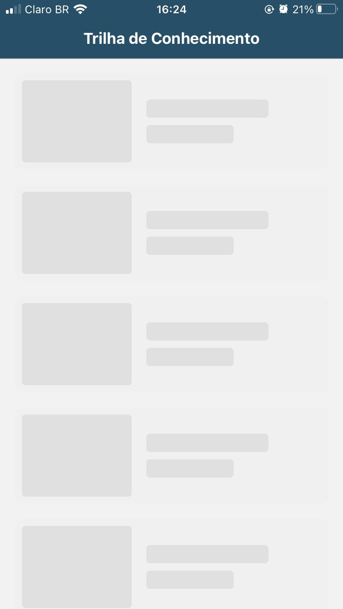

# Aplicação de Vídeo com React Native e Expo

Este projeto é uma aplicação de listagem e reprodução de vídeos desenvolvida em React Native utilizando Expo. A aplicação permite que os usuários naveguem entre diferentes telas, reproduzam vídeos usando HLS, realizem chamadas de API que retornam conteúdo dinamicamente utilizando um servidor JSON simulado com `json-server`, e pequenas animações para melhorar a experiência do usuário.

## Prints do App





## Índice

- [Aplicação de Vídeo com React Native e Expo](#aplicação-de-vídeo-com-react-native-e-expo)
  - [Índice](#índice)
  - [Pré-requisitos](#pré-requisitos)
  - [Configuração do Ambiente](#configuração-do-ambiente)
    - [1. Clonar o Repositório](#1-clonar-o-repositório)
    - [2. Instalar o Node.js e npm](#2-instalar-o-nodejs-e-npm)
    - [3. Instalar o Expo CLI](#3-instalar-o-expo-cli)
  - [Configuração do Projeto](#configuração-do-projeto)
    - [1. Instalar as Dependências](#1-instalar-as-dependências)
    - [2. Configurar o `babel.config.js`](#2-configurar-o-babelconfigjs)
    - [3. Configurar o `json-server`](#3-configurar-o-json-server)
  - [Executando a Aplicação](#executando-a-aplicação)
    - [1. Iniciar o Servidor JSON](#1-iniciar-o-servidor-json)
    - [2. Iniciar o Servidor de Desenvolvimento](#2-iniciar-o-servidor-de-desenvolvimento)
    - [3. Executar no Emulador ou Dispositivo Físico](#3-executar-no-emulador-ou-dispositivo-físico)
  - [Estrutura do Projeto](#estrutura-do-projeto)
  - [Funcionalidades Implementadas](#funcionalidades-implementadas)
  - [Testes](#testes)
    - [Executando os Testes](#executando-os-testes)
  - [Bibliotecas e Ferramentas Utilizadas](#bibliotecas-e-ferramentas-utilizadas)
  - [Dicas e Considerações](#dicas-e-considerações)

---

## Pré-requisitos

Antes de começar, certifique-se de ter os seguintes itens instalados em sua máquina:

- **Node.js** (versão recomendada: LTS v16.x ou superior)
- **npm** (geralmente instalado junto com o Node.js)
- **Expo CLI**
- **Git** (para clonar o repositório)
- **json-server** (para simular a API)
- Emulador Android/iOS ou dispositivo físico com o aplicativo **Expo Go** instalado

## Configuração do Ambiente

### 1. Clonar o Repositório

Clone este repositório para sua máquina local:

```bash
git clone https://github.com/seu-usuario/meu-app-video.git
```

## 2. Instalar o Node.js e npm

Caso ainda não tenha, instale o **Node.js** (versão LTS recomendada). Você pode baixá-lo em [nodejs.org](https://nodejs.org/).

Verifique a instalação executando:

```bash
node -v
npm -v
```

## 3. Instalar o Expo CLI

Instale o Expo CLI globalmente:

```bash
npm install -g expo-cli
```

## Configuração do Projeto

### 1. Instalar as Dependências

Instale as dependências do projeto:

```bash
npx expo install @react-navigation/native @react-navigation/native-stack
npx expo install react-native-screens react-native-safe-area-context
npx expo install expo-av
npx expo install react-native-reanimated react-native-gesture-handler
npm install axios
npm install --save-dev jest @testing-library/react-native @testing-library/jest-native

```

### 2. Configurar o babel.config.js

Instale as dependências do projeto:

```bash
module.exports = function (api) {
  api.cache(true);
  return {
    presets: ['babel-preset-expo'],
    plugins: [
      'react-native-reanimated/plugin', // Deve ser o último plugin na lista
    ],
  };
};
```
### 3. Configurar o json-server

Instale o json-server globalmente (caso ainda não tenha):

```bash
npm install -g json-server
```

Crie um arquivo db.json na raiz do projeto com o seguinte conteúdo:

```bash
{
  "videos": [
    {
      "id": 1,
      "title": "Título do Vídeo 1",
      "description": "Descrição do Vídeo 1",
      "thumbnail": "URL da miniatura",
      "videoUrl": "URL do vídeo em HLS",
      "views": 0,
      "likes": 0
    }
    // Adicione mais vídeos conforme necessário
  ]
}
```

## Executando a Aplicação

### 1. Iniciar o Servidor JSON

Em um novo terminal, inicie o `json-server`:

```bash
json-server --watch db.json --port 3000
```

O servidor estará disponível em http://localhost:3000

## Executando a Aplicação

### 2. Iniciar o Servidor de Desenvolvimento

Em um novo terminal, inicie o `json-server`:

```bash
npx expo start
```

### 3. Executar no Emulador ou Dispositivo Físico
- Emulador Android:

   - Certifique-se de que o Android Studio e um dispositivo virtual (AVD) estejam configurados.
   - No Expo Dev Tools, clique em "Run on Android device/emulator".
- Simulador iOS (macOS necessário):

   - Certifique-se de que o Xcode está instalado.
   - No Expo Dev Tools, clique em "Run on iOS simulator".
- Dispositivo Físico:

   - Instale o aplicativo Expo Go no seu dispositivo a partir da App Store ou Google Play Store.
   - Escaneie o QR code exibido no Expo Dev Tools com o aplicativo Expo Go.
   - Certifique-se de que o dispositivo móvel e o computador estão na mesma rede Wi-Fi.

## Estrutura do Projeto

A estrutura de pastas do projeto é a seguinte:

```
├── App.tsx                 # Arquivo principal do app
├── babel.config.js         # Configuração do Babel
├── db.json                 # Banco de dados simulado para o `json-server`
├── tsconfig.json           # Configuração do TypeScript
├── src/                    # Código-fonte
│   ├── assets/             # Recursos estáticos (imagens, ícones, etc.)
│   ├── components/         # Componentes reutilizáveis
│   ├── navigation/         # Configuração de navegação
│   ├── screens/            # Telas do app (Home, Video Detail)
│   ├── services/           # Serviços (ex: chamadas de API)

```

**Descritivo da estrutura:**

- assets/: Imagens, ícones e outros recursos.
- components/: Componentes reutilizáveis.
- navigation/: Configurações de navegação.
- screens/: Telas da aplicação (Home, Video Detail).
- services/: Interações com a API (axios).


## Funcionalidades Implementadas
- **Home Screen:**

   - Exibe uma lista de vídeos obtidos da API simulada.
   - Cada item mostra uma miniatura e o título do vídeo.
   - Ao clicar em um item, o usuário é direcionado para a tela de detalhes.

- **Video Detail Screen:**

   - Reproduz o vídeo selecionado utilizando HLS.
   - Exibe título, descrição, número de views e likes.
   - Permite incrementar likes e views.

- **Animações:**

   - Animação de transição entre telas.
   - Animação ao exibir a lista de vídeos.

## Testes

Os testes foram implementados utilizando **Jest** e **React Native Testing Library.**

### Executando os Testes

Para executar os testes, rode:

```
npm run test
```

## Bibliotecas e Ferramentas Utilizadas

- Expo: Plataforma para desenvolvimento de aplicativos React Native.
- React Navigation: Navegação e roteamento.
- axios: Cliente HTTP para realizar requisições à API.
- json-server: Simula uma API REST.
- expo-av: Reprodução de áudio e vídeo.
- react-native-reanimated: Animações.
- Jest: Framework de testes.
- React Native Testing Library: Utilitários para testes de componentes.

## Dicas e Considerações

Adicione uma seção com dicas úteis, como:

- **Verificação de Versões:** Certifique-se de que todas as bibliotecas são compatíveis com a versão do Expo e React Native em uso. Use:
```
npx expo install pacote

```

- **Limpar Cache:** Caso enfrente problemas, execute:
```
npx expo start -c

```

- **Testar URLs de Vídeo:** Utilize um player como HLS.js para testar URLs de vídeo.


## Dicas e Considerações

- **Endereço IP para a API:**

   - Se estiver executando em um dispositivo físico, substitua localhost pelo endereço IP da sua máquina nas chamadas à API.
   
- **Variáveis de Ambiente:**

   - Considere usar um arquivo .env para armazenar URLs e outras configurações.

- **Limpar Cache do Expo:**

   - Se encontrar problemas, tente limpar o cache com **npx expo start -c**.

- **Versões Compatíveis:**

   - Utilize **npx expo install** ao instalar pacotes para garantir a compatibilidade com a versão do Expo.

- **Configurar Endereços IP na API:**

- Adicione um alerta sobre o uso do IP correto ao configurar o json-server.

   - **Adicione: Se estiver usando um dispositivo físico, certifique-se de substituir localhost pelo IP local da máquina onde o servidor JSON está sendo executado. Você pode encontrar o IP local usando o comando:** 
      ```
         ipconfig (Windows)
         ifconfig (Mac/Linux)
      ```